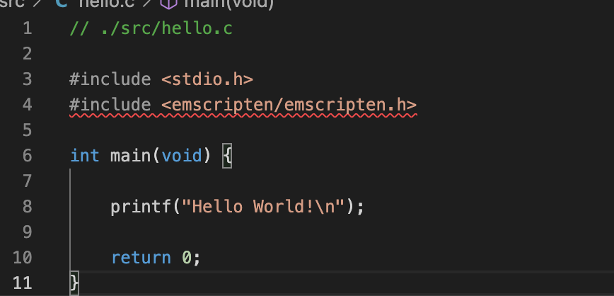
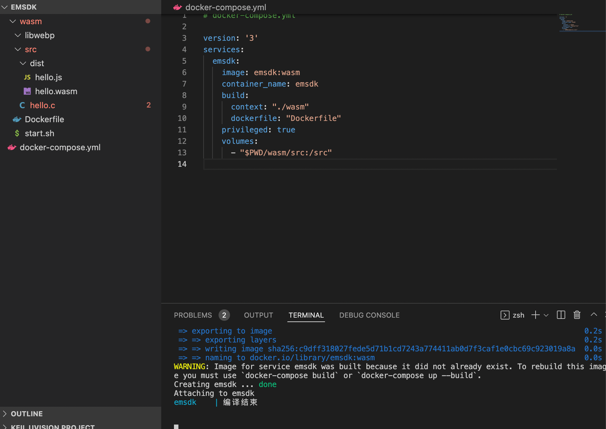
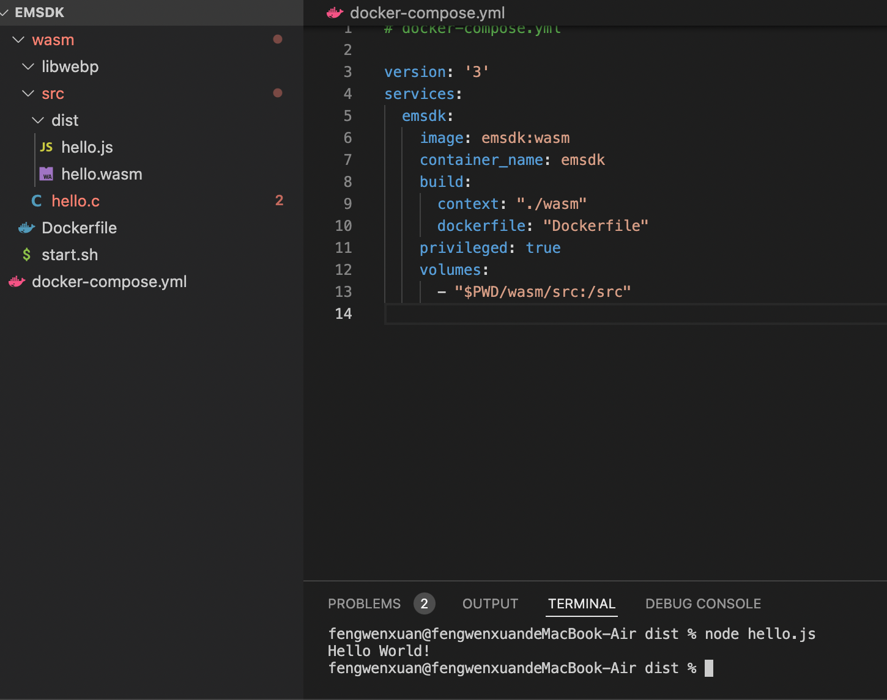
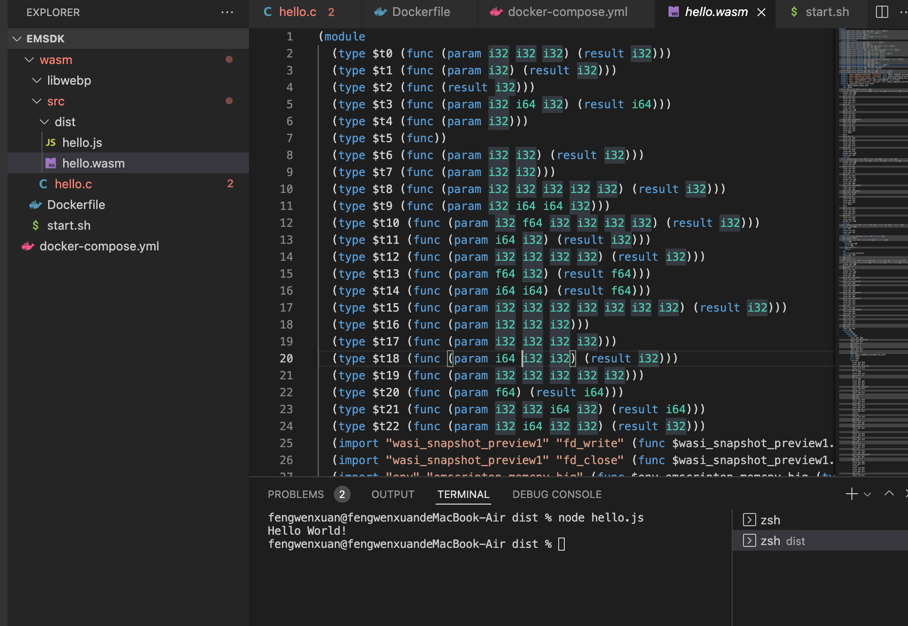

# 前端发展-webassmebly初探-docker搭建环境


# 前景

目前`webassembly`经过几年的发展，在`web AR`、游戏、分布计算、音视频处理等方面大放光彩。

未来前端的发展必然离不开`wasm`。如果是做基建，则要在`wasm`的基础上学习`rust`、`golang`、`C/C++`等。

这些暂且不表，先从`wasm`入门开始。


# 1. 什么是`wasm`

- WebAssembly是由主流浏览器厂商组成的 W3C 社区团体 制定的一个新的规范
- WebAssembly/wasm WebAssembly 或者 wasm 是一个可移植、体积小、加载快并且兼容 Web 的全新格式
- 在调用其他底层语言的过程，将其转化为`wasm`的二进制文件


# 2. 开始准备

## 1. 目录结构

1. 新建目录`emsdk`
2. 在`emsdk`中新建`src, libwebp`

目录结构为:

```shell
├── emsdk
│   ├── libwebp
│   └── src
```

## 2. 新建底层语言

本文以`C`为例，在`src`文件下新建`hello.c`文件。

```c
// ./src/hello.c

#include <stdio.h>

int main(int argc, char** argv) {
    printf("Hello World!");

    return 0;
}
```

基础的代码功能已经实现——打印`hello world`。为了能让`wasm`调用这个文件，需要对外提供一个方法，因此需要在这个代码基础上再进行修改。

- 引入头文件`emscripten/emscripten.h`,此文件为编译时必须文件。(由于此时没有引入`emsdk`，因此会提示找不到文件，暂时先不管这个问题)



- 暂时越过不讲`EMSCRIPTEN_KEEPALIVE`的含义

```C
// ./src/hello.c

#include <stdio.h>
#include <emscripten/emscripten.h>

int main(void) {

    printf("Hello World!\n");

    return 0;
}

#ifdef __cplusplus

extern "C" {

#endif

EMSCRIPTEN_KEEPALIVE void myFunction(int argc, char** argv) {
    printf("call this callback\n");
}

#ifdef __cplusplus
}
#endif

```

## 3. `docker`环境搭建

`wasm`的官方已经在`docker`提供了`emsdk`的集成镜像。但由于`docker`的官方镜像过于简陋，做了一些定制化的改动，并且新增脚本来处理和编译。

- [docker官方emsdk Image](https://hub.docker.com/r/emscripten/emsdk)

在`emsdk`目录下新建文件`Dockerfile`,写入以下内容

```dockerfile
FROM emscripten/emsdk

ENV START /start

ADD ./start.sh $START/start.sh

RUN apt update && apt install -y ninja-build

WORKDIR $START

CMD ["sh", "/start/start.sh"]
```

新建`shell`文件,名字叫`start.sh`

```shell
#!/bin/bash

rm -f *.html *.js *.wasm

# 普通编译
emcc /src/hello.c -o /src/dist/hello.js

echo '编译结束'

tail -f /dev/null
```

此时的目录结构为:

```shell
.
├── Dockerfile
├── libwebp
├── src
│   ├── dist
│   └── hello.c
└── start.sh
```

## 4. `docker-compose`自动化

我本人不喜欢一个个字符去敲`docker`的命令，想到可以用`docker-compose`去自动化处理，就立刻进行处理。

1. 新建`wasm`文件夹，把所有文件放进去。
2. 新建`docker-compose.yml`文件。

```yml
# docker-compose.yml

version: '3'
services:
  emsdk:
    image: emsdk:wasm
    container_name: emsdk
    build:
      context: "./wasm"
      dockerfile: "Dockerfile"
    privileged: true
    volumes:
      - "$PWD/wasm/src:/src"

```

生成结果:



执行生成的`hello.js`，查看执行结果



可以看到此时生成的文件成功调用了`hello.c`

查看到`wasm`文件的具体内容:




---

下期介绍引入模板编译
